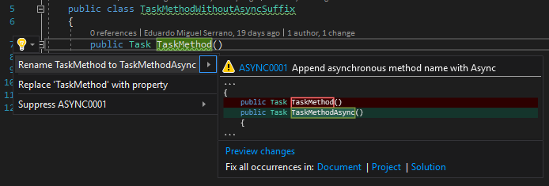

.. the orphan tag avoids the build warning about the rst file not being present in any toc tree

:orphan:

.. _async-method-names-should-be-suffixed-with-async:

Asynchronous method names should end with Async
===============================================

**Identifier**: ASYNC0001

**Default Action**: Warning

**Rationale**: Makes the intent of asynchronous code more visible.

