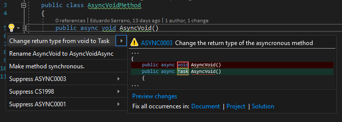

.. the orphan tag avoids the build warning about the rst file not being present in any toc tree

:orphan:

.. _avoid-async-void-methods:

Avoid void returning asynchronous method
===============================================

**Identifier**: ASYNC0003

**Default Action**: Warning

**Rationale**: When an async void method is called execution flow continues as opposed to having a Task returning method and awaiting it. This fire and forget behaviour is not usually what one wants. Async void methods should only be used for event handlers and in exceptional fire and forget cases. However if one is used make sure it is at least wrapped in a try catch block to avoid exceptions going unhandled. 

