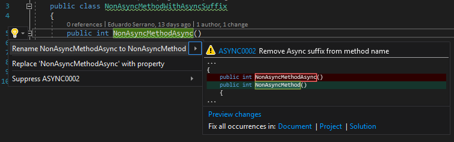

.. the orphan tag avoids the build warning about the rst file not being present in any toc tree

:orphan:

.. _non-async-method-names-should-not-be-suffixed-with-async:

Non asynchronous method names should end with Async
===================================================

**Identifier**: ASYNC0002

**Default Action**: Warning

**Rationale**: It conveys the wrong intent about the code. 

