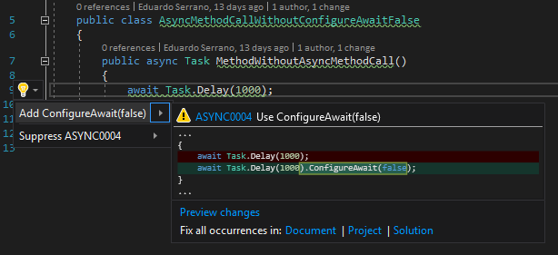

.. the orphan tag avoids the build warning about the rst file not being present in any toc tree

:orphan:

.. _use-configure-await-false:

Use ConfigureAwait(false) on await expression
===============================================

**Identifier**: ASYNC0004

**Default Action**: Warning

**Rationale**: Performance optimization that avoids thread context switching. 

