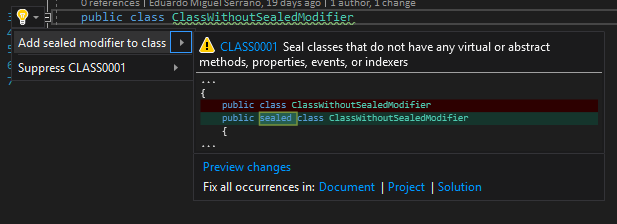

.. the orphan tag avoids the build warning about the rst file not being present in any toc tree

:orphan:

.. _set-class-as-sealed:

Seal class 
===================================================

**Identifier**: CLASS0001

**Default Action**: Warning

**Rationale**: Seal classes that do not have any virtual or abstract methods, properties, events, or indexers. You should seal classes that you do not intend to allow inheritance on. This is a very debated topic and you should read about it and then make an informed decision. 

