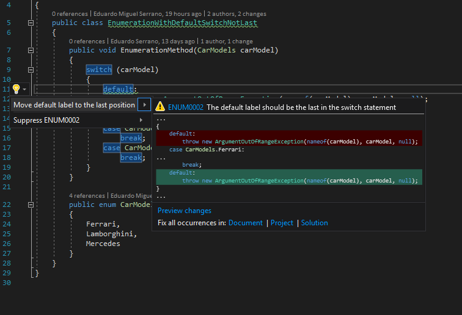

.. the orphan tag avoids the build warning about the rst file not being present in any toc tree

:orphan:

.. _default-label-should-be-the-last:

Default switch label
===================================================

**Identifier**: ENUM0001

**Default Action**: Warning

**Rationale**: The default label should be the last in the switch statement. This is a style choice in favor of code readibility.

