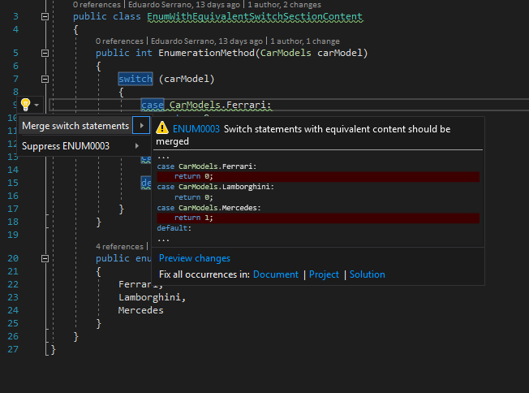

.. the orphan tag avoids the build warning about the rst file not being present in any toc tree

:orphan:

.. _merge-switch-sections-with-equivalent-content:

Merge switch sections
===================================================

**Identifier**: ENUM0002

**Default Action**: Warning

**Rationale**: Switch statements with equivalent content should be merged. This is a style choice in favor of code readibility.

