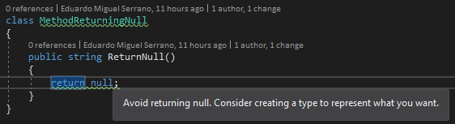

.. the orphan tag avoids the build warning about the rst file not being present in any toc tree

:orphan:

.. _do-not-return-null:

Do not return null
===================================================

**Identifier**: RETURN0001

**Default Action**: Warning

**Rationale**: Avoid returning null. Consider creating a type that representes what you mean when returning null. Doing so will make the code more honest and avoid having null checks to prevent NullReferenceException exceptions.

Regarding code honesty consider the following: is a method that returns an instance of User honest if it can sometimes return a User and sometimes return null if the user is not found? Should it not be more appropriate to return something that explicitly says that it might return a user or nothing?

And what if there are other error scenarios that you want to express? Should you return null in the event of any error scenario or should it be better to create a type that might contain a user or an error?

If this rationale does not apply to your domain the consider changing the default action of this analyzer to Info or disable it. For information on how to configure analyzers see :ref:`here <how-to-configure-roslyn-analyzers>`.

