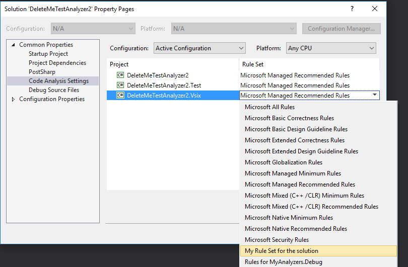

.. _how-to-configure-roslyn-analyzers:

How to configure Roslyn analyzers
=================================

You can alter the default behavior of the analyzers available in your solution. Let's say you've installed a nuget with lots of useful analyzers but there are some that you would like to disable or maybe there is a project where you would like to have analyzer X enabled and another project where the same analyzer should be disabled. How do we handle this?

This can be achieved by using rule sets. 

.. _net-framework-projs:

Configure a rule set for a project
----------------------------------

.. note:: If you want to configure a rule set for a .NET Core or .NET Standard project skipt to :ref:`net-core-and-standard-projs`.

Once you have installed the analyzer in your project, right click Analyzers under the project's References and chose Open Active Rule Set.

.. image:: images/open_active_rule_set.png

This will open tooling inside Visual Studio that will enable you to change the default action of an analyzer. You can change an analyzer to go from a simple build warning to a build error or disable it by setting the action to None.

.. image:: images/config_rule_set.png

Once you've configured the rules as you want save the file. When the rule set is saved Visual Studio will create a ruleset file in the project's directory, add it to the project and change the csproj file to add a <CodeAnalysisRuleSet> property into the <PropertyGroup> section that points to the custom rule set you just created.

.. _net-core-and-standard-projs:

.NET Core and .NET Standard projects
~~~~~~~~~~~~~~~~~~~~~~~~~~~~~~~~~~~~

Unfortunately Visual Studio 2017 does not have tooling support for configuring ruleset files for .NET Core and .NET Standard projects. However you can still do it manually by creating a custom rule set and telling the csproj to use it.
You start by creating the `ruleset file <https://docs.microsoft.com/en-us/visualstudio/code-quality/how-to-create-a-custom-rule-set>`_. Once you have the ruleset file edit the csproj and add a <CodeAnalysisRuleSet> into the <PropertyGroup> that points to the ruleset file you want. The path can be a full path or a path relative to the project file. Here is an example::
	
	<PropertyGroup>
		<TargetFramework>netstandard1.4</TargetFramework>
		<CodeAnalysisRuleSet>.\NetStandard.ruleset</CodeAnalysisRuleSet>
	</PropertyGroup>

Once you've configured the rule set you might have to restart Visual Studio for the changes to take effect fully.

.. note:: If you're not confortable with creating your own from scratch I advise creating a .NET Framework project, adding the analyzer you want to it and then following the steps :ref:`mentioned previously <net-framework-projs>`. Once Visual Studio generates the ruleset file for you edit it to make sure it only contains the rules you care about. 

Configure a rule set for a solution
-----------------------------------

The first thing you need is a custom rule set. To create one follow the indications in the previous steps.

.. note:: If you chose to create a custom rule set by using the tooling inside Visual Studio it will add that file to the project you've selected to create the custom rule set for. Since this rule set is going to be applied to the solution I advise you to copy the file from the projects directory and add it to the same direction as your solution. Do not leave the file in the projects directory after copying it to the solution's directory.

Make sure the Name property of your custom rule set uniquely identifies the ruleset file as there can be many ruleset files in a solution and as we will see this name is what the Visual Studio tooling uses to let you chose which rule set you want to apply for each project.

Put the ruleset file in a directory of your chosing. For instance in the same directory as your solution file is. Once you have the custom rule set in the directory you want right click your solution in Visual Studio, chose Add->Existing Item and select the custom rule set.

Now that you have created and added the custom rule set to the solution go to the solution's properties and select the Code Analysis Settings tab under Common Properties. This will show you all the projects that can have rule sets configured using the Visual Studio tooling. Just select the rule set you created from the drop down list.

Keep in mind that the tooling for rule sets in Visual Studio 2017 does not support .NET Core and .NET Standard projects. This doesn't mean you can not have a solution wide rule set for your projects. It just means you will have to manually add your solution wide rule set to your .NET Core and .NET Standard projects by following the indications :ref:`here <net-core-and-standard-projs>`.

.. _references:

.. note:: For more information see the microsoft docs:

   * `How to: Create a Custom Rule Set <https://docs.microsoft.com/en-us/visualstudio/code-quality/how-to-create-a-custom-rule-set>`_
   * `Working in the Code Analysis Rule Set Editor <https://docs.microsoft.com/en-us/visualstudio/code-quality/working-in-the-code-analysis-rule-set-editor>`_
   * `How to: Specify Managed Code Rule Sets for Multiple Projects in a Solution <https://docs.microsoft.com/en-us/visualstudio/code-quality/how-to-specify-managed-code-rule-sets-for-multiple-projects-in-a-solution>`_
