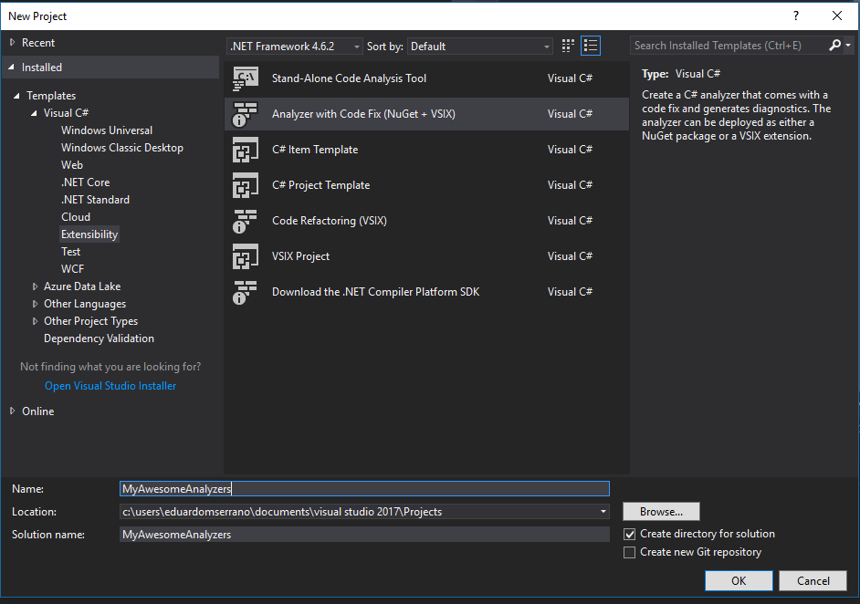

.. _how-to-start:

How to create a Roslyn Analyzer project for C#
==============================================

This is a step by step guide on how to create a C# Roslyn Analyzer project for Visual Studio.

.. note:: Everything shown here was tested on Visual Studio 2017.

Requirements
-------------

* `Visual Studio <https://www.visualstudio.com/downloads/>`_
* `.NET Compiler Platform SDK <https://marketplace.visualstudio.com/items?itemName=VisualStudioProductTeam.NETCompilerPlatformSDK>`_

.. note:: This guide was tested using:

   * Version 1.4 of the .NET Standard framework for the .NET Standard project that has the analyzers.
   * Version 4.6.2 of the .NET Framework for the unit test project.
   * Version 2.2.0 of the nuget Microsoft.CodeAnalysis.CSharp.Workspaces.    
   * Visual Studio 2017 Version 15.2

   See :ref:`here <nuget-packages>` for more information on what nuget versions you should use.

.. _easy-way:

The quick and easy way
----------------------

Once you have installed the .NET Compiler Platform SDK you can get started quickly by using the built in templates to create a new analyzer project.
Go to File->New->Project then select Extensibility under Templates->Visual C#. 

Make sure the .NET framework version selected is 4.6.2 and you will be able to see
a template called Analyzer with Code Fix (Nuget + VSIX).

Once you have created your new project the template will create three projects for you:

* **A portable class library**: where the code for your analyzer is. This project is also configured to produce a nuget package upon building.
* **A test project**: this test project is quite handy since it serves as a starting to point to how you can test your analyzers.
* **A VSIX project**: this has two purposes. It produces a VSIX file which can be used to install your analyzers as a `Visual Studio Extension <https://www.visualstudio.com/vs/extend/>`_ and it will also enable you to debug your analyzer.

.. image:: images/vs_analyzers_template_2.PNG

And you're set to go. I advise you to explore the default analyzer (DiagnosticAnalyzer.cs) and code fix provider (CodeFixProvider.cs) that are created as part of the template in the portable class library project as well as the tests (UnitTests.cs) that are in the test project.

.. _pro-way:

The #Pro way
------------

Although templates are great to get you started they might not fit your case. Also if you want to understand how everything works then this section will give you a better understanding of all the magic that the default template does for you.

.. _creating-analyzer-proj:

Creating the project for your analyzer code
~~~~~~~~~~~~~~~~~~~~~~~~~~~~~~~~~~~~~~~~~~~

Let's start by creating a blank solution. Once the blank solution is created we need to add a new project to it that will serve as the project where the code for your analyzers is. Although the template creates a portable class library project you are free to select another type of project as long as there is support from the .NET Compiler platform SDK for it.

In this case let's create a .NET Standard Class library project. Go to File->Add->New Project, select .NET Standard under Templates->Visual C# and then select Class Library (.NET Standard).

Now let's edit the project so that we can install the nugets we require to create our analyzers. Right click the project and select Edit.

.. image:: images/edit_cs_proj.png

Edit the cs proj file in order to set the `PackageTargetFallback <https://docs.microsoft.com/en-us/nuget/schema/msbuild-targets#packagetargetfallback>`_ as follows::

	<Project Sdk="Microsoft.NET.Sdk">
		<PropertyGroup>
			<TargetFramework>netstandard1.4</TargetFramework>
			<PackageTargetFallback>portable-net45+win8+wp8+wpa81</PackageTargetFallback>
		</PropertyGroup>
	</Project>

Save and close the cs proj file and add the following nuget to the .NET Standard project:

* `Microsoft.CodeAnalysis.CSharp.Workspaces <https://www.nuget.org/packages/Microsoft.CodeAnalysis.CSharp.Workspaces>`_ version 2.2.0. 

Creating the debug project
~~~~~~~~~~~~~~~~~~~~~~~~~~

The debug project as the name suggests will allow you to debug the code of your analyzers. For that we will create a VSIX project. VSIX projects are used to create `extensions for Visual Studio <https://www.visualstudio.com/vs/extend/>`_ and although we are creating a VSIX project the intent is not to then distribute the resulting VSIX file. We could do that and when users installed the VSIX file they would have access to the analyzers you've developed but for distributing the analyzers I think a nuget package is better. 

The VSIX project is still what we want because once configured and set as the startup project it will launch an `experimental version of Visual Studio <https://docs.microsoft.com/en-us/visualstudio/extensibility/the-experimental-instance>`_
that is being debugged by the Visual Studio process that launched it (the one that has your analyzer solution). This will allow you to create a new project and test your analyzers with break points to aid your development.

Go to File->New->Project then select Extensibility under Templates->Visual C#. Make sure the .NET framework version selected is 4.6.2 and you will be able to see a template called VSIX Project.

Once you've created the VSIX project you get three files:

* **stylesheet.css**: you can delete this since you don't need it.
* **index.html**: you can delete this since you don't need it.
* **source.extension.vsixmanifest**: this one is where you configure the properties for your extension.

We need to configure the source.extension.vsixmanifest so that it uses the analyzer project we created in the previous step.
Double click the source.extension.vsixmanifest and:

* Change the Product Name on the top to be what you want.
* Give it a description.
* On the Assets tab click new and add an entry with a Type of Microsoft.VisualStudio.MefComponent. On Source select A project in current solution and in the Project select the project that has the code for your analyzers. In our case it would be the .NET Standard project created :ref:`in the previous step <creating-analyzer-proj>`. Leave the Embed in this folder empty and click OK.
* On the Assets tab click new and add an entry with a Type of Microsoft.VisualStudio.Analyzer. On Source select A project in current solution and in the Project select the project that has the code for your analyzers. In our case it would be the .NET Standard project created :ref:`in the previous step <creating-analyzer-proj>`. Leave the Embed in this folder empty and click OK.

By adding an asset of type Microsoft.VisualStudio.Analyzer you have enabled the code for any analyzer you create in the analyzers project to be packaged by the VSIX project. And by adding an asset of type Microsoft.VisualStudio.MefComponent you have enabled the code for any code fix provicer you create in the analyzers project to be packaged by the VSIX project.

As a last step make sure the VSIX project will launch an `experimental version of visual studio <https://docs.microsoft.com/en-us/visualstudio/extensibility/the-experimental-instance>`_. This should be set by default but confirm by going to the VSIX project properties and checking that the Debug tab has the following:

* Under Start action the option to Start external program should be selected and the location should be where you have installed visual studio. Something like C:/Program Files (x86)/Microsoft Visual Studio/2017/Enterprise/Common7/IDE/devenv.exe.
* Under Start options the Command line arguments should be set to /rootsuffix Exp

.. _creating-test-proj:

Creating the test project
~~~~~~~~~~~~~~~~~~~~~~~~~

Just create a regular unit test project and add the following nugets:

* `Microsoft.CodeAnalysis.CSharp.Workspaces <https://www.nuget.org/packages/Microsoft.CodeAnalysis.CSharp.Workspaces>`_ version 2.2.0.

Now you can reference the .NET Standard project and create your tests. I recommend that you copy the folders Helpers and Verifiers that are created as part of the test project when using the template Analyzer with Code Fix (Nuget + VSIX). See :ref:`easy-way`. These classes contain methods that will greatly help you understand how to test your analyzers and code fixes. 

In my own projects I've copied and changed the classes in these folder so that I could use them the way I wanted but they will work fine if you use them as they are.
