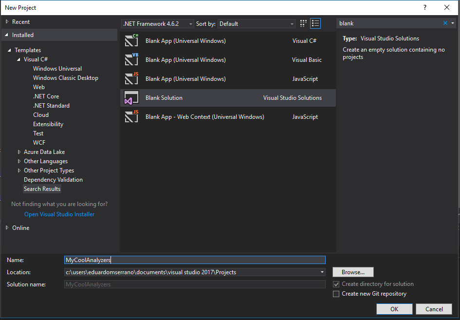
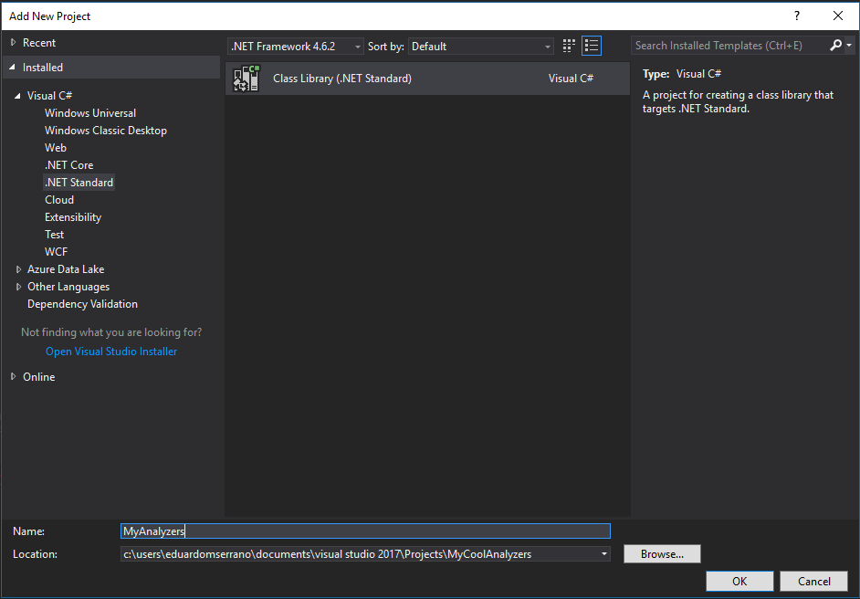

How to create a Roslyn Analyzer project for C#
==============================================

This guide will show you how to create a Roslyn Analyzer for C# in Visual Studio step by step.

.. note:: Everything shown here was tested on Visual Studio 2017.

Requirements
-------------

* `Visual Studio <https://www.visualstudio.com/downloads/>`_
* `.NET Compiler Platform SDK <https://marketplace.visualstudio.com/items?itemName=VisualStudioProductTeam.NETCompilerPlatformSDK>`_

The quick and easy way
----------------------

Once you have installed the .NET Compiler Platform SDK you can get started quickly by using the built in templates to create a new analyzer project.
Go to File->New->Project then select Extensibility under Templates->Visual C#. Make sure the .NET framework version selected is 4.6.2 and you will be able to see
a template called Analyzer with Code Fix (Nuget + VSIX).

.. image:: images/vs_analyzers_template.PNG

Once you have created your new project the template will create three projects for you:

* A portable class library: where the code for your analyzer is. This project is also configured to produce a nuget package upon building.
* A test project: this test project is quite handy since it serves as a starting to point to how you can test your analyzers.
* A Vsix project: this has two purposes. It produces a Vsix file which can be used to install your analyzers as a `Visual Studio Extension <https://www.visualstudio.com/vs/extend/>`_ and it will also enable you to debug your analyzer.

.. image:: images/vs_analyzers_template_2.PNG

And you're set to go. I advise you to explore the default analyzer (DiagnosticAnalyzer.cs) and code fix provider (CodeFixProvider.cs) that are created as part of the template in the portable class library project as well as the tests (UnitTests.cs) that are in the test project.

The #Pro way
----------------------

Although templates are great to get you started they might not fit your case. Also if you want to understand you everything works then by this section will give you a better understanding of all the magic that the default template does for you.

Go to File->New->Project, on the top right search for blank solution. Select the Blank Solution template, give a name to your solution and select OK.

Once your blank solution is created we need to add a new project to it that will serve as the project where the code for your analyzers is. Although the template creates a portable class library project you are free to select another type of project as long as there is support from the .NET Compiler platform SDK for it. In this case let's create a .NET Standard Class library project. Go to File->Add->New Project, select .NET Standard under Templates->Visual C# and then select Class Library (.NET Standard).

Now let's edit the project so that we can install the nugets we require to create our analyzers. Right click the project and select Edit.

.. image:: images/edit_cs_proj.PNG

Edit the cs proj file in order to set the PackageTargetFallback as follows::

	<Project Sdk="Microsoft.NET.Sdk">
		<PropertyGroup>
			<TargetFramework>netstandard1.4</TargetFramework>
			<PackageTargetFallback>portable-net45+win8+wp8+wpa81</PackageTargetFallback>
		</PropertyGroup>
	</Project>

